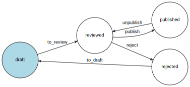

# sf_workflow
A very basic blog app to practice [symfony/workflow](https://symfony.com/doc/current/components/workflow.html) component.

## Installation
- Install dependencies with `composer install`.
- Edit the _.env_ file with your database info.
- Create the database: `php bin/console doctrine:database:create`
- Run the migrations: `php bin/console doctrine:migration:migrate`
- Load the fixtures to add new users: `php bin/console doctrine:fixtures:load --no-interaction`

If you update the workflow configuration in _config/packages/workflow.yaml_, you can update
the _workflow.svg_ file with the following command:

`php bin/console workflow:dump article_workflow | dot -Tsvg -o workflow.svg` 

> As mentionned in the [documentation](https://symfony.com/doc/current/workflow/dumping-workflows.html), Graphviz
is required for this command to work properly.

## So far...
I have created a _state_machine_ workflow that allows to log places and transitions.
The workflow is based on the Article entity's status field and is using a custom context,
that's why I chose the "method" type for the _marking_store_ property of the workflow.

### Places
The workflow currently has four different places:
- **draft**: an article is created by a user, but it requires a spellcheck before a decision
about its publication can be taken. This can be done by every logged in user. **It is the initial
marking**.
- **reviewed**: a user with a `ROLE_SPELLCHECKER` role or a user with a `ROLE_ADMIN` role
reviewed the article, looking for grammar or spelling mistakes. This cannot be done by
a user who only has a `ROLE_WRITER` role.
- **rejected**: once an article has been reviewed, it can be rejected by a user who has a `ROLE_ADMIN` role.
- **published**: once an article has been reviewed, it can be published by a user who has a `ROLE_ADMIN` role.

### Transitions

